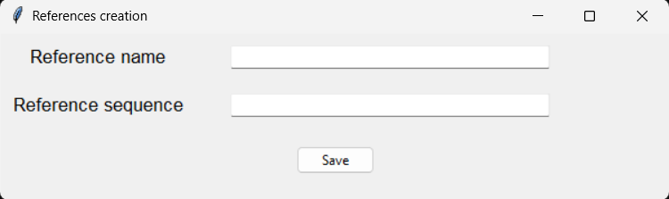
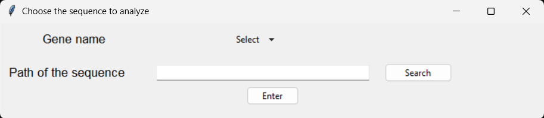
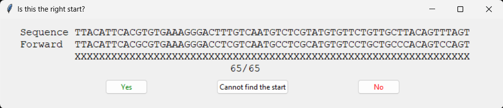
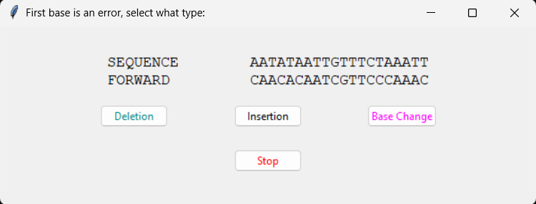
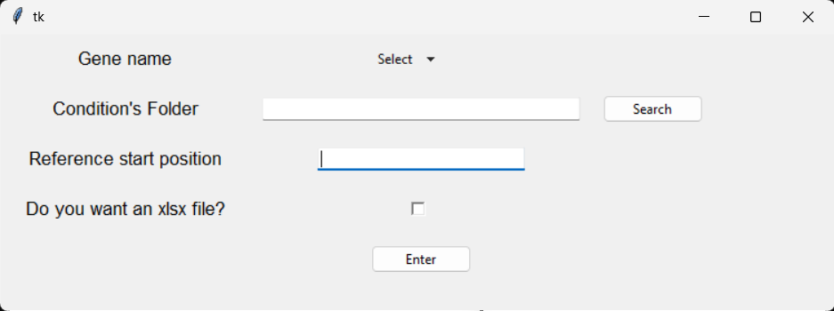
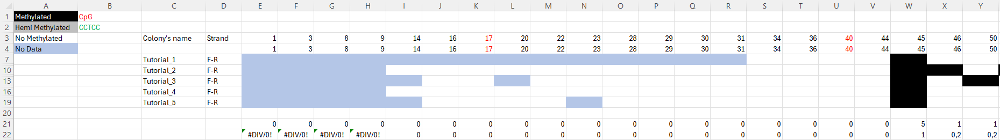
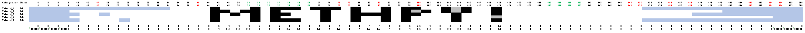

# MethPy


MethPy is a Python toolkit for the analysis and visualization of DNA methylation data, with features for quality control, table and graph generation, and management of reference datasets.

## :pushpin: Table of Contents
1. [Main Features](#header1)
2. [Installation](#header2)
3. [Usage](#header3)
     1. [Start](#header4)
     2. [Tutorial](#header5)
     3. [Ref](#header6)
     4. [Check](#header7)
     5. [Table](#header8)
     6. [plot](#header9)
4. [Project Structure](#header10)
5. [License](#header11)
6. [Author](#header12)


## :gear: Main Features<a name="header1"/> 

- Loading and validation of methylation data
- Analysis and quality control (`check.py`)
- Visualization of results (`plot.py`)
- Management of biological references (`ref.py`)
- Table generation (`table.py`)
- Guided execution (`start.py`, `tutorial.py`)

## :rocket: Installation<a name="header2"/>

Must have: Python ≥ 3.8 installed.

```bash
git clone https://github.com/Smarties98/MethPy.git
cd MethPy
pip install .
```

Using  `pip` directly:

```bash
pip install git+https://github.com/Smarties98/MethPy.git
```

## :compass: Usage<a name="header3"/>

Start main interface from the terminal and enter in the Python interactive interpreter by typing `python`, `python3`, or `py` in the terminal, depending on the system configuration.

#### :open_file_folder: Start<a name="header4"/>
Import the module `start` and call it like a function to generate all the folders:
```python
from methpy import start
start ()
```
All generated folders are organized in the following tree structure: 
```
cwd/
├── Charts             # Where plot saves charts
├── Input              # Where to save the Input files
├── Output in txt      # Where check saves the txt files
├── Output in word     # Where check saves the word files
├── References         # Where all the references are saved
└── Table              # Where table saves the csv and xlsx files
```

#### :books: Tutorial<a name="header5"/>

Refer to the `tutorial.py` module to generate different examples to use as tutorial.
```python
from methpy import tutorial
tutorial ()
```
They will be saved in text file in `./Input/Sequence tutorial` while the relative reference is saved as TutorialF.txt (forward) and TutorialR.txt (reverse) in `./References`.

#### :bookmark: Ref<a name="header6"/>
Use the `ref.py` module to save a reference, both the forward and the reverse, in `./References`
```python
from methpy import ref
ref ()
```

The module generates a popup window in which all the info could be added:



If characters different from the ones related to the nucleotides (A,T,C,G) are inserted in the sequence, they are conserved in the text files (both in the forward and reverse) but a warning is printed. 


#### :heavy_check_mark: Check<a name="header7"/>
To start the analysis use `check.py`.

```python
from methpy import check
check ()
```
This module will generate different popup windows. If something is wrong with the info provided the module prints a warning message.

The first window asks for all the information:



The "Gene name" should be selected from the dropdown menu while the "Path of the sequence" could be written or picked using the system’s file browser. The Input files could be inserted in different subfolders. The button "Enter" would start the checking.

First step is to identify the beginning of the sequence compared to the reference, `check.py` asks for confirmation of the start through a popup window.  



The bisulfite assay converts the non-methylated cytosines in uraciles, subsequently converted in thymines through amplification. Every other difference between sequence and reference is treated as a sequencing error. A new popup window is generated, with the error that is the first character displayed, and the type of error can be selected.



At the end of the analysis two files are generated, a text file and a word file. 

The text file is saved in `./Output in txt` and in the same subfolders present in `./Input`. It is suddived as following:
* Name of the original file
* positions of methylated cytosines (one for each row)
* doubtful_c_positions
* positions of cytosines where the methylation status in unknown (one for each row)
* the last position analyzed
* F o R, depending of the strand

The word file is saved in `./Output in word` and in the same subfolders present in `./Input`. The first row is the name of the sequence, then there is which strand it is and then the actual sequence. It is divided in blocks of ten nucleotides and in the left there is the position of the first base relatively to the beginning of the reference. All the error and cytosine, or converted cytosine, are highlighted, the color code is explained in the document together with some positions that could be interesting, i.e. where there is an insertion (in that case the nucleotide is removed and the info can be useful where checking the input sequence), all the positions where there is a methylated cytosine and all the ones of cytosines with an unkown methylation status.

#### :card_file_box: Table<a name="header8"/>
Run `table.py` to generate a summary table of the data obtained from a single folder.

> [!TIP]
> Place all input data related to a single target gene and a single experimental condition within a subdirectory, which may be located inside a nested folder structure, to generate a summary table and subsequently a plot for that specific gene under that condition.








#### :bar_chart: Plot<a name="header9"/>


## :file_folder: Project Structure<a name="header10"/>

```
methpy/
├── check.py        # Data quality control
├── plot.py         # Graphical visualization
├── ref.py          # Reference management
├── start.py        # Folders generation
├── table.py        # Table generation
└── tutorial.py     # Examples
```

## :page_facing_up: License<a name="header11"/>

This project is distributed under the [MIT](./LICENSE) license.

## :technologist: Author<a name="header12"/>

Developer: Martina Roiati (institutional email: roiati.2013400@studenti.uniroma1.it, personal email: martiroiati@gmail.com)<br /> 
Corresponding Author: Andrea Fuso, PhD (institutional email: andrea.fuso@uniroma1.it)<br />
Additional support provided by: Andrea Cattani and Emiliano Valente
