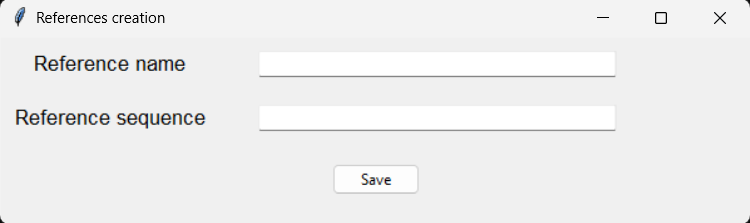
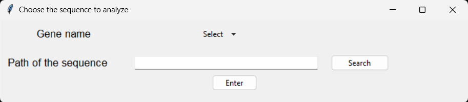
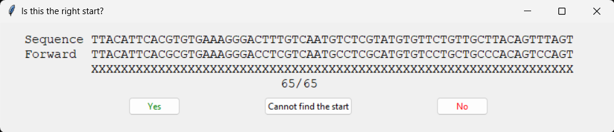
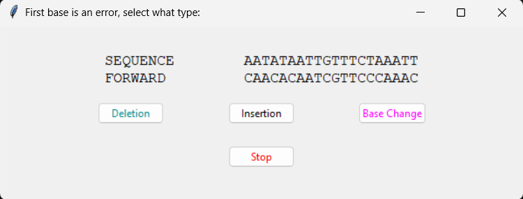

# MethPy


MethPy is a Python toolkit for the analysis and visualization of DNA methylation data, with features for quality control, table and graph generation, and management of reference datasets.

## :test_tube: Main Features

- Loading and validation of methylation data
- Analysis and quality control (`check.py`)
- Visualization of results (`plot.py`)
- Management of biological references (`ref.py`)
- Table generation (`table.py`)
- Guided execution (`start.py`, `tutorial.py`)

## :rocket: Installation

Must have: Python ≥ 3.8 installed.

```bash
git clone https://github.com/Smarties98/MethPy.git
cd MethPy
pip install .
```

Using  `pip` directly:

```bash
pip install git+https://github.com/Smarties98/MethPy.git
```

## :compass: Usage

Start main interface from the terminal and enter in the Python interactive interpreter by typing `python`, `python3`, or `py` in the terminal, depending on the system configuration.

#### :open_file_folder: Start
Import the module `start` and call it like a function to generate all the folders:
```python
from methpy import start
start ()
```
All generated folders are organized in the following tree structure: 
```
cwd/
├── Charts             # Where plot saves charts
├── Input              # Where to save the Input files
├── Output in txt      # Where check saves the txt files
├── Output in word     # Where check saves the word files
├── References         # Where all the references are saved
└── Table              # Where table saves the csv and xlsx files
```

#### :books: Tutorial 

Refer to the `tutorial.py` module to generate different examples to use as tutorial.
```python
from methpy import tutorial
tutorial ()
```
They will be saved in text file in `./Input/Sequence tutorial` while the relative reference is saved as TutorialF.txt (forward) and TutorialR.txt (reverse) in `./References`.

#### :bookmark: Ref
Use the `ref.py` module to save the reference, both the forward and the reverse, in `./References`
```python
from methpy import ref
ref ()
```

The module generates a popup window in which all the info could be added:



If characters different from the ones related to the nucleotides (A,T,C,G) are inserted they are conserved in the text files (both in the forward and reverse) but a warning is printed. 


#### :heavy_check_mark: Check
To start the analysis use `check.py`.

```python
from methpy import check
check ()
```
This module will generate different popup windows. If something is wrong with the info provided the module prints a warning message.

The first window asks for all the information:



The "Gene name" should be selected from the dropdown menu while the "Path of the sequence" could be written or picked using the system’s file browser. The button "Enter" would start the checking.

First step is to identify the beginning of the sequence compared to the reference, `check.py` asks for confirmation of the start through a popup window.  



The bisulfite assay converts the non-methylated cytosines in uraciles, they are converted in 
thymines through amplification. Every other differences between sequence and reference are treated as errors.




#### :card_file_box: Table


#### :bar_chart: Plot


## :file_folder: Project Structure

```
methpy/
├── check.py        # Data quality control
├── plot.py         # Graphical visualization
├── ref.py          # Reference management
├── start.py        # Folders generation
├── table.py        # Table generation
└── tutorial.py     # Examples
```

## :page_facing_up: License

This project is distributed under the [MIT](./LICENSE) license.

## :technologist: Author

Developer: Martina Roiati<br /> 
Corresponding Author: Andrea Fuso, PhD<br />
Additional support provided by: Andrea Cattani and Emiliano Valente
