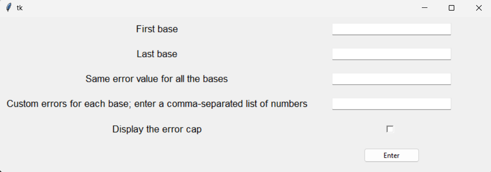
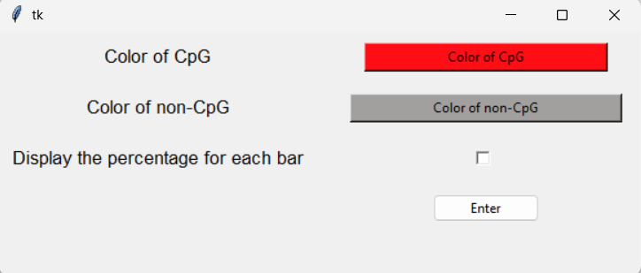

# MethPy


MethPy is a Python toolkit for the analysis and visualization of DNA methylation data, with features for quality control, table and graph generation, and reference dataset management.

## :pushpin: Table of Contents
1. [Main Features](#header1)
2. [Installation](#header2)
3. [Usage](#header3)
     1. [Start](#header4)
     2. [Tutorial](#header5)
     3. [Ref](#header6)
     4. [Check](#header7)
     5. [Table](#header8)
     6. [plot](#header9)
4. [Project Structure](#header10)
5. [License](#header11)
6. [Author](#header12)
7. [How to cite](#header13)


## :gear: Main Features<a name="header1"/> 

- Loading and validating methylation data
- Performing analysis and quality control (`check.py`)
- Visualizing results (`plot.py`)
- Managing biological references (`ref.py`)
- Generating tables (`table.py`)

## :rocket: Installation<a name="header2"/>

Python ≥ 3.8 must be installed.

To install via cloning the repository:

```bash
git clone https://github.com/Smarties98/MethPy.git
cd MethPy
pip install .
```

Or install directly using `pip`:

```bash
pip install git+https://github.com/Smarties98/MethPy.git
```

## :compass: Usage<a name="header3"/>

Launch the main interface from the terminal, and enter the Python interactive interpreter by typing `python`, `python3`, or `py` in the terminal, depending on the system configuration.

#### :open_file_folder: Start<a name="header4"/>
Import the `start` module and call it like a function to generate all required folders: 

```python
from methpy import start
start ()
```

All generated folders are organized in the following directory structure: 

```
cwd/
├── Charts             # Where `plot` saves charts
├── Input              # Where to save the input files
├── Output in txt      # Where `check` saves the .txt files
├── Output in word     # Where `check` saves the Word files
├── References         # Where all the references are stored
└── Table              # Where `table` saves the csv and xlsx files
```

> [!IMPORTANT]
> Place all input data related to a single target gene and a single experimental condition within a subdirectory. This subdirectory may be nested within other folders. This structure is necessary to generate a summary table and, subsequently, a plot for that specific gene under that condition.

> [!WARNING]
> A nested folder structure can be created inside `./Input`, but forward and reverse sequences must have the same filename, with F or R appended to indicate the strand. This naming convention is required for the `table` module to correctly associate the corresponding data.


#### :books: Tutorial<a name="header5"/>

Refer to the `tutorial` module to generate examples files that can be used as tutorial.

```python
from methpy import tutorial
tutorial ()
```

They will be saved as text file in `./Input/Sequence tutorial`, while the corresponding references will be saved as `TutorialF.txt` (forward) and `TutorialR.txt` (reverse) in `./References`.

#### :bookmark: Ref<a name="header6"/>
Use the `ref` module to save a reference — both the forward and the reverse — in `./References`.

```python
from methpy import ref
ref ()
```

The module generates a popup window where all the necessary information can be entered:


If characters other than standard nucleotides (A, T, C, G) are included in the sequence, they are retained in the text files (both forward and reverse), but a warning is printed.

#### :heavy_check_mark: Check<a name="header7"/>
To start the analysis use the `check` module.

```python
from methpy import check
check ()
```

This module will generate several popup windows. If there is an issue with the provided information, the module will print a warning message.

The first window asks for all the necessary information:


The "Gene name" should be selected from the dropdown menu, while the "Path of the sequence" can be typed or selected using the system’s file browser. Input files can be placed in different subfolders. The "Enter" button starts the checking process.

The first step is to identify the beginning of the sequence relative to the reference. The `check` module asks for confirmation of the start through a popup window:


The bisulfite assay converts unmethylated cytosines into uracils, which are subsequently converted into thymines during amplification. Every other difference between the sequence and the reference is treated as a sequencing error. A new popup window appears, showing multiple characters with the first one being the error, allowing the user to select the error type:


At the end of the analysis, two files are generated: a text file and a Word file.

The text file is saved in `./Output in txt` within the same subfolders present in `./Input`.
It is organized as follows:
* Name of the original file
* Positions of methylated cytosines (one per row)
* `doubtful_c_positions`
* Positions of cytosines where the methylation status is unknown (one per row)
* The last position analyzed
* F o R, depending on the strand

The word file is saved in `./Output in word` within the same subfolders present in `./Input`. The first row shows the name of the sequence, followed by the strand information, then the actual sequence. It is divided into blocks of ten nucleotides. On the left, the position of the first base relative to the beginning of the reference is shown. All errors and cytosines (or converted cytosines) are highlighted. The color code is explained in the document, along with some positions of interest — for example, where there is an insertion (in this case, the nucleotide is removed, and this information is useful when checking the input sequence), all positions with methylated cytosines, and those with unknown methylation status.

#### :card_file_box: Table<a name="header8"/>
Run `table` to generate a summary table of the data obtained from a single folder.

```python
from methpy import table
table ()
```

Once the module starts, it generates a popup window asking for various pieces of information.


The "Gene name" can be selected through a dropdown menu, showing all saved references. The "Condition's Folder" refers to the path of the folder to be tabulated. "Reference start position" indicates the position at which the saved reference starts, relative to the one stored in the database. Checking "Do you want an xlsx file?" will generate an additional, more graphical file alongside the CSV file.

Both files contain rows with strand information F, R, and F-R, which merge data from the forward and reverse strands of the same sequence.

The CSV file is organized as following:

|   | Colony's name | Strand | list of numbers referring to the cytosines positions)|
| ------------- | ------------- |------------- |------------- |
| CpG presence | |   |0 (no CpG) or  CpG |
| 0 | | | numbers referring to the position relative to the sequence in the database |
| 1 | Sequence name | Strand (F, R or F-R) | methylation data (Methylated, No Methylated or No Data)|
| ...    | ...   | ...   | ...   |
| Percentage |    |   | floating number indicating the percentage of methylation for that position |

The XLSX file provides the same data, enhanced with color-coded formatting. In the top-left corner, there is a color legend. This file is designed so that changing the value of a cell recalculates the sum of methylated cytosines and the percentage for that position. Only the row containing F-R is shown; all other rows are hidden.


#### :bar_chart: Plot<a name="header9"/>
The `plot` module can be used to plot all the data related to a particular folder and save the graphs in `.\Charts`

```python
from methpy import plot
plot ()
```

The module opens a popup window asking for information:


The "Table file name" is a dropdown menu in which the table file can be selected. "Gene name" and "Experimental condition" are optional but will be included in the graph. The resolution can be changed by entering a value in the specific text box. The file extension can be selected among `.tif`, `.pdf` and `.jpg`. The "Click me!" button referring to "Custom settings for base range and errors" opens the following window:



Here, a specific range of bases to consider can be specified. If a number is entered in "Same error value for all the bases", that value is used to add an error bar to all cytosine present in the graph. The option "Custom errors for each base; enter a comma-separated list of numbers" allows inputting a comma-separated list of values, assigning a different error bar to each cytosine; if there are fewer values than cytosines, the remaining cytosines will have an error of zero. Checking "Dysplay the error cap" will add caps to the error bars.

The button "Click me!" referring to "Custom chart colors" opens the following window:



In this window, the colors of the bars can be selected, as well as whether to display the percentage over each bar. The initial colors are red for CpG cytosines and gray for non-CpG ones. After the first use, if new colors are selected, they are saved and shown as the new default colors. The choices regarding displaying the error cap and the percentage for each bar are also saved.

The main graph produced contains both CpG and non-CpG cytosines. Additionally, two other graphs are generated: one with only Cpg cytosines and another with only non-CpG cytosines.


## :file_folder: Project Structure<a name="header10"/>

```
methpy/
├── check.py        # Data quality control
├── plot.py         # Graphical visualization
├── ref.py          # Reference management
├── start.py        # Folders generation
├── table.py        # Table generation
└── tutorial.py     # Examples
```

## :page_facing_up: License<a name="header11"/>

This project is distributed under the [MIT](./LICENSE) license.

## :technologist: Author<a name="header12"/>

Developer: Martina Roiati (institutional email: roiati.2013400@studenti.uniroma1.it, personal email: martiroiati@gmail.com)<br /> 
Corresponding Author: Andrea Fuso, PhD (institutional email: andrea.fuso@uniroma1.it)<br />
Additional support provided by: Andrea Cattani and Emiliano Valente

## :open_book: How to cite<a name="header13"/>
